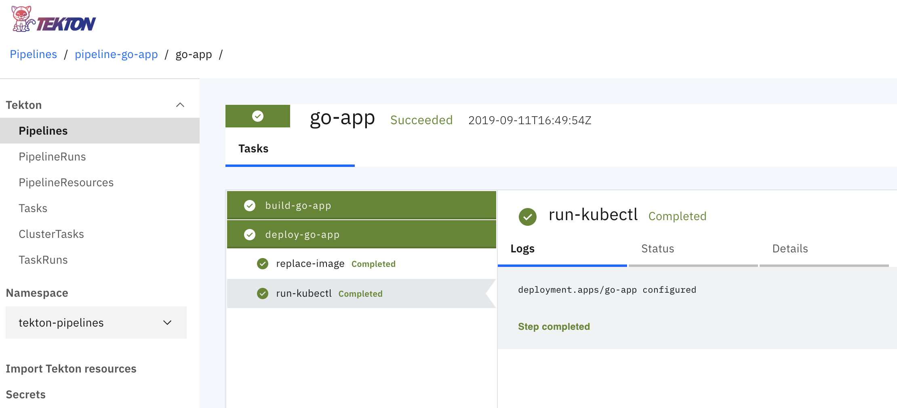

# Tekton Demo

## Warning

Integration with WebHook is in progress!!

```sh
$ make
Cloud Native CI/CD with Tekton (yngpil.yoon@gmail.com)

Usage:
  make <target>
  help                            Show the usage (default target)
  tekton-install                  Install the latest Tekton and Tekton Dashboard into your cluster
  tekton-install-tkn              Install the `tkn` CLI into your OS X machine
  tekton-tasks                    Show all Tekton task definitions
  tekton-runs                     Show all Tekton runs
  task-hello-world                Define a simple task that will echo "hello world"
  task-run-hello-world            Execute a simple task that defined as 'echo-hello-world' Task
  task-build-go-app               Create go-app resources to be defined for go-app, and execute build-push task
  task-build-go-app-kaniko        Build go-app with using a Task from the Tekton Catalog
  tekton-install-webhook          Create resources for Tekton Triggers
  task-deploy-go-app              Deploy go-app with build-push-deploy pipelines and its pipelines
  k8s-secrets                     Create a Secret manifest, which is used to store your Docker Hub credentials
```

## Overview

- [Official Tutorial](https://github.com/tektoncd/pipeline/blob/master/docs/tutorial.md)
- Examples
  - [TaskRuns](https://github.com/tektoncd/pipeline/tree/master/examples/taskruns)
  - [PipelineRuns](https://github.com/tektoncd/pipeline/tree/master/examples/pipelineruns)
- Event
  - [Tekton Trigger](https://github.com/tektoncd/triggers)
  - [Tekton Githook](https://gitlab.com/pongsatt/githook)



